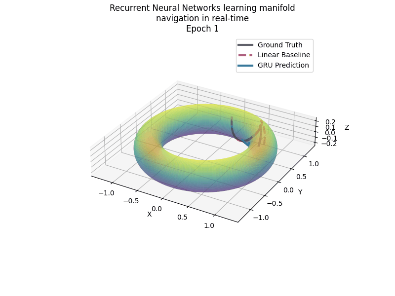
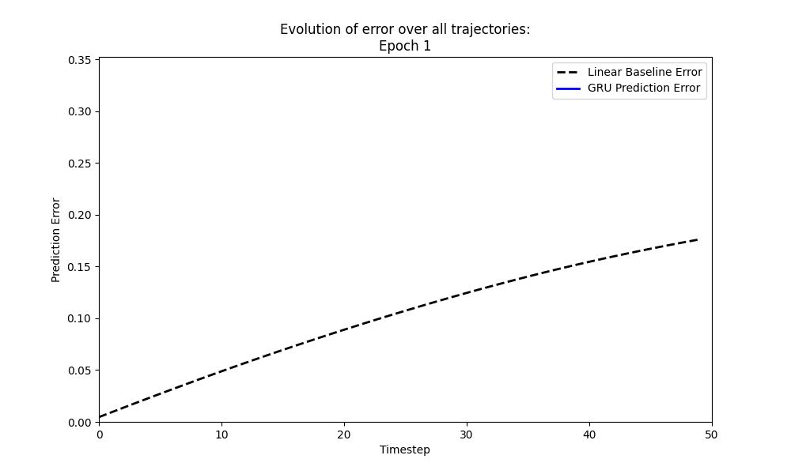

# ManiNav — Manifold Navigation

A framework for learning to predict trajectories on Riemannian manifolds using recurrent neural networks.

## Overview

<p align="center"></p>

Supported surfaces: **torus**, **sphere**, **plane**, **neural (reconstructed) surface** or **custom surfaces specified by an immersion function**.

Supported dataset generation processes: **Brownian motion**, **AR(1)**.
=======
ManiNav trains sequence-to-sequence models (RNN, LSTM, GRU) to navigate on curved surfaces by learning the curvature and geometry implicitly from training trajectory data. Given an initial position and a sequence of velocity increments, the model predicts positions along the manifold — outperforming a naive flat-space (Euclidean) baseline.

Below is a visualization of how errors in the estimates for $[x_1, \ldots, x_n]$ averaged over the entire test data evolve over model training.

<p align="center"></p>

## Problem Description

Assume you are navigating a curved manifold $M$. You start at an initial position $x_0$, and a stream of velocities $[v_1, \ldots, v_n]$ measured at times $t=1, \ldots, n$. You need to predict your positions $[x_1, \ldots, x_n]$ at times $t=1, \ldots, n$. (This is known in navigation literature as [dead reckoning](https://en.wikipedia.org/wiki/Dead_reckoning).)

Due to curvature of manifolds, we cannot track position by simple velocity addition, and need a curvature-aware approach.


Supported surfaces: **torus**, **sphere**, **plane**, **neural (reconstructed) surface** or **custom surfaces specified by an immersion function**.


## Other Contributions

We develop a GPU-accelerated framework for generating trajectories on manifolds specified by the user. We use PyTorch as backend for differential geometric computations and TorchDiffEq for integrating geodesic equations on the GPU.

Currently supported dataset generation processes: **Brownian motion**, **AR(1)**.
>>>>>>> fc80870 (convergence visualization)

## Project Structure

```
maninav/
├── generate.py              # Generate trajectory datasets on a manifold
├── train.py                 # Train models
├── evaluate.py              # Evaluate trained models on test data
└── src/
    ├── geodesic_solver.py   # Riemannian geometry: metric tensor, Christoffel symbols, geodesic ODE
    ├── helper.py            # Utility functions (data loading, model importing, error computation)
    ├── random_generators.py # Stochastic process simulation (Brownian, AR1) via geodesic integration
    ├── datasets/
    │   └── {surface}/{process}/
    │       ├── X0.pt        # Initial positions
    │       ├── V.pt         # Velocity increments
    │       └── pos.pt       # Ground-truth positions
    ├── math_functions/
    │   ├── plane_math.py
    │   ├── sphere_math.py
    │   ├── torus_math.py
    │   └── recon_surface_math.py   # Neural-network-parameterized surface
    ├── model_definitions/
    │   └── models.py        # RNN, LSTM, GRU, and variant architectures
    └── training/
        └── execute.py       # Full training loop, logging, and error animation
```

Results are saved under `results/`:
```
results/
├── animations/{surface}/{process}/{setup}/{model}/
└── model_weights/{surface}/{process}/{setup}/{model}/d_{dim}/run_{i}.pth
```

## Quickstart

### 1. Generate Data

Edit `generate.py` to set your surface, process, bounding box, and immersion function, then run:

```bash
python generate.py
```

Datasets are saved to `src/datasets/{surface}/{process}/`.

### 2. Train

Edit `train.py` to configure the model, surface, and hyperparameters:

```python
model_names = ['lstm']   # 'rnn', 'lstm', 'gru'
hidden_dim  = [32]       # hidden state dimension
surface     = 'torus'
dataset     = 'ar1'      # 'brownian', 'ar1'
train_loss  = ['k_50']   # loss aggregation scheme
```

Then run:

```bash
python train.py
```

Weights are saved to `results/model_weights/` and an error-evolution animation to `results/animations/`.

### 3. Evaluate

Edit `evaluate.py` to point to the desired surface/dataset/setup, then run:

```bash
python evaluate.py
```

## Models

| Name | Class | Description |
|------|-------|-------------|
| `rnn` | `RNN` | Single-layer Elman RNN; initial position encoded into hidden state |
| `lstm` | `ConditionalLSTM` | LSTM conditioned on initial position |
| `gru` | `ConditionalGRU` | GRU conditioned on initial position |
| `2lrnn` | `RNN_multilayer` | Multi-layer RNN |

All models take `(X0, V)` as input — initial chart coordinates and a sequence of velocity increments — and output predicted chart coordinates at each timestep.

## Loss Aggregation Schemes

Training loss is MSE in the ambient (embedded) space, averaged over a selected subset of prediction timesteps:

| Setup | Indices aggregated |
|-------|--------------------|
| `basic` | last timestep only |
| `k_20` | all 1–20 |
| `k_30` | all 1–30 |
| `k_50` | all 1–50 |

Custom index sets (e.g., `handpicked`) can be passed via `agg_indices` in `train.py`.

## Geometry

`src/geodesic_solver.py` provides the `Immersed_Manifold` class:

- **`compute_metric_tensor`** — first fundamental form $g_{ij}$ via automatic differentiation of the immersion
- **`compute_christoffel_symbols`** — Levi-Civita connection coefficients $\Gamma^k_{ij}$
- **`exp`** — Riemannian exponential map via ODE integration (`torchdiffeq`)

Trajectories are generated by numerically integrating the geodesic equation at each step and adding process noise.

## Dependencies

- [PyTorch](https://pytorch.org/)
- [torchdiffeq](https://github.com/rtqichen/torchdiffeq)
- [matplotlib](https://matplotlib.org/) (+ ImageMagick for saving animations)
- [tqdm](https://tqdm.github.io/)
- numpy
